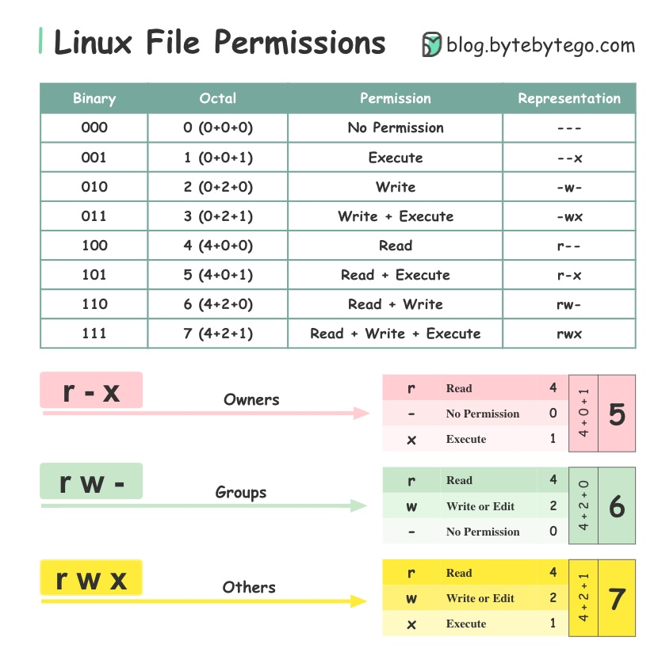

# Introduction to File Permissions in Linux

In the world of Linux, file permissions play a crucial role in maintaining the security and integrity of the system. Understanding file permissions is essential for every Linux user, whether you are a beginner or an experienced administrator. In this comprehensive guide, we will explore the basic concepts of file permissions, how they work, and how to manage them effectively.

## Basic Concepts of File Permissions:

### Three Core Parts of File Permissions

File permissions consist of three distinct parts, each denoted by a letter:

- **Read (r):**
  - Allows a user to view the contents of a file.
  - Permits listing files within a directory.

- **Write (w):**
  - Enables a user to modify or delete a file.
  - Allows the creation of new files within a directory.

- **Execute (x):**
  - Grants a user the ability to run a file as a program.
  - Allows access to a directory, providing the user the capability to navigate through it.

### File Permissions for Directories

File permissions for directories in Linux are similar to those for files but with some distinctions. Understanding these differences is crucial for managing access to directories effectively.

#### Core Directory Permissions

- **Read Permission (r):**
  - Allows a user to list the files within the directory.
  - Without this permission, a user cannot see the contents of the directory.

- **Write Permission (w):**
  - Enables a user to create, delete, or rename files within the directory.
  - Without write permission, a user cannot make any changes to the directory's content.

- **Execute Permission (x):**
  - Necessary to access the contents of a directory.
  - Allows the user to navigate through subdirectories.

#### Accessing Files within Directories

**Importance of Execute Permission:**
To access a file within a directory, both the file and the directory must have the necessary permissions. Even if a user has read permission on the file, they cannot access it if the directory containing the file lacks the execute permission.

**Example Scenario:**
If a user has read permission for a file (file.txt) but the directory it's in does not have execute permission, the user won't be able to access or view the file.

----


----
## File Ownership and Group Ownership in Linux

In the Linux operating system, every file and directory is closely tied to two key attributes: file ownership and group ownership. These attributes play a pivotal role in determining who can access and manipulate files and directories.

1. **Owner / User :**
   - **Definition:**
     - The owner is the user who initially created the file or directory.
     - Represents the primary individual with control over the file.
   - **Permissions:**
     - File ownership dictates the permissions for the owner.
     - The owner has specific read, write, and execute permissions, defining what actions they can perform on the file.

2. **Group:**
   - **Definition:**
     - The group is a collection of users with common access rights.
     - Provides a way to organize users with shared permissions into a single entity.
   - **Permissions:**
     - Group ownership sets the permissions for the group associated with the file.
     - Members of the group share a common set of permissions, distinct from those of the owner.

3. **Others:**
   - **Definition:**
     - All users who are not the owner or part of the group fall under the category of "others."
   - **Permissions:**
     - Others have their own set of permissions, independent of the owner and group.
     - Their access rights are typically more limited than those of the owner and group.

**Managing File Permissions:**
**Importance of Understanding Ownership:**
Understanding file ownership and group ownership is crucial for managing file permissions effectively. It allows administrators to control and grant specific access rights to different users based on their roles and responsibilities.

**Ensuring Necessary Access:**
Properly configuring ownership and group ownership ensures that the right users have the necessary access to files and directories.

## Symbolic Notation of File Permissions

In Linux, symbolic notation is used to represent file permissions concisely. This notation uses a combination of letters and symbols to depict the read (r), write (w), and execute (x) permissions. The permissions for the owner, group, and others are displayed using a series of nine characters: three for the owner, three for the group, and three for others.

### Symbolic Notation Components:

- **r:** Read
- **w:** Write
- **x:** Execute
- **-:** No permission

**Notation Structure:**
Three characters for the owner, three for the group, and three for others.

**Example 1: Read and Write for Owner, Read-Only for Group and Others**
**Symbolic Notation:** `rw-r--r--`
**Breakdown:**
- Owner: `rw-` (Read and Write permissions)
- Group: `r--` (Read-only permissions)
- Others: `r--` (Read-only permissions)

**Example 2: Read, Write, and Execute for Owner, Read for Group, No Permissions for Others**
**Symbolic Notation:** `rwxr--r--`
**Breakdown:**
- Owner: `rwx` (Read, Write, and Execute permissions)
- Group: `r--` (Read-only permissions)
- Others: `r--` (Read-only permissions)

**Example 3: Execute Only for Owner and Group, No Permissions for Others**
**Symbolic Notation:** `--x--x---`
**Breakdown:**
- Owner: `--x` (Execute-only permissions)
- Group: `--x` (Execute-only permissions)
- Others: `---` (No permissions)

**Example 4: Read and Execute for Owner, Write for Group, No Permissions for Others**
**Symbolic Notation:** `r-x-w----`
**Breakdown:**
- Owner: `r-x` (Read and Execute permissions)
- Group: `-w-` (Write-only permissions)
- Others: `---` (No permissions)

**Example 5: Read and Write for Owner, Execute for Group, No Permissions for Others**
**Symbolic Notation:** `rw--x---`
**Breakdown:**
- Owner: `rw-` (Read and Write permissions)
- Group: `--x` (Execute-only permissions)
- Others: `---` (No permissions)

## Numeric Notation of File Permissions

In addition to symbolic notation, file permissions in Linux can be represented using numeric notation. Numeric notation offers a more concise and efficient way to express file permissions by assigning numeric values to each permission type: read (r) is represented by 4, write (w) by 2, and execute (x) by 1. The numeric values are then added together to calculate the numeric notation for a specific set of permissions.

### Numeric Values:

- **4:** Read
- **2:** Write
- **1:** Execute

**Calculating Numeric Notation:**
Add the corresponding numeric values for read, write, and execute.

**Example 1: Read and Write for Owner, Read-Only for Group and Others**
**Numeric Notation:** `644`
**Breakdown:**
- Owner: `6` (read + write)
- Group: `4` (read)
- Others: `4` (read)

**Example 2: Read, Write, and Execute for Owner, Read for Group, No Permissions for Others**
**Numeric Notation:** `744`
**Breakdown:**
- Owner: `7` (read + write + execute)
- Group: `4` (read)
- Others: `4` (read)

**Example 3: Execute Only for Owner and Group, No Permissions for Others**
**Numeric Notation:** `111`
**Breakdown:**
- Owner: `1` (execute)
- Group: `1` (execute)
- Others: `0` (no permissions)

**Example 4: Read and Execute for Owner, Write for Group, No Permissions for Others**
**Numeric Notation:** `541`
**Breakdown:**
- Owner: `5` (read + execute)
- Group: `2` (write)
- Others: `0` (no permissions)

**Example 5: Read and Write for Owner, Execute for Group, No Permissions for Others**
**Numeric Notation:** `664`
**Breakdown:**
- Owner: `6` (read + write)
- Group: `5` (execute)
- Others: `4` (read)

## Viewing and Changing File Permissions

**Viewing File Permissions:**
- **Command:** `ls -l`
- Displays detailed information, including file permissions, using symbolic notation.

**Changing File Permissions:**
- **Command:** `chmod`
- Allows modification of owner, group, and others' permissions.

**Symbolic Notation Example:**
- Grant read and write to the owner: `chmod u+rw filename`
- Remove execute for others: `chmod o-x filename`

**Numeric Notation Example:**
- Grant read and write to the owner: `chmod 600 filename`
- Remove execute for others: `chmod 644 filename`




Revoking file permissions involves removing or restricting access to files or directories for specific users or groups. Here, I'll explain how to revoke file permissions in Linux using the `chmod` command with various examples and scenarios.

# Revoking File Permissions in Linux

Revoking file permissions involves removing or restricting access to files or directories for specific users or groups. Here, I'll explain how to revoke file permissions in Linux using the `chmod` command with various examples and scenarios.

## 1. Basic `chmod` Syntax

The `chmod` command is used to change file permissions. The basic syntax is:

```bash
chmod [permissions] file_or_directory

```

### 2. Revoke Read, Write, or Execute Permissions:

- **Scenario 1: Revoke Read Permission for Others:**
  ```bash
  chmod o-r file_name
  ```
  - Removes read permission for others (users who are not the owner or in the group).

- **Scenario 2: Revoke Write Permission for Group:**
  ```bash
  chmod g-w file_name
  ```
  - Removes write permission for the group.

- **Scenario 3: Revoke Execute Permission for Owner:**
  ```bash
  chmod u-x script.sh
  ```
  - Removes execute permission for the owner.

### 3. Revoke Permissions for Multiple Groups or Users:

- **Scenario 4: Revoke Read and Write Permissions for Others and Group:**
  ```bash
  chmod go-rw file_name
  ```
  - Removes read and write permissions for both the group and others.

- **Scenario 5: Revoke Execute Permission for Owner and Group:**
  ```bash
  chmod ug-x script.sh
  ```
  - Removes execute permission for both the owner and the group.

### 4. Revoke All Permissions:

- **Scenario 6: Revoke All Permissions for Others:**
  ```bash
  chmod o-rwx file_name
  ```
  - Removes read, write, and execute permissions for others.

- **Scenario 7: Revoke All Permissions for Group and Others:**
  ```bash
  chmod go-rwx file_name
  ```
  - Removes all permissions for both the group and others.

### 5. Revoke Permissions Recursively:

- **Scenario 8: Revoke Write Permission for Group Recursively:**
  ```bash
  chmod -R g-w directory_name
  ```
  - Removes write permission for the group and all files/directories within the specified directory.

### 6. Revoke Special Permissions (SetUID, SetGID, Sticky Bit):

- **Scenario 9: Revoke SetUID Permission:**
  ```bash
  chmod u-s executable_file
  ```
  - Removes the SetUID permission, which allows a user to execute the file with the permissions of the file owner.

- **Scenario 10: Revoke SetGID Permission:**
  ```bash
  chmod g-s directory_name
  ```
  - Removes the SetGID permission for a directory, which makes new files created in the directory inherit the group ownership of the parent directory.

- **Scenario 11: Revoke Sticky Bit:**
  ```bash
  chmod +t shared_directory
  ```
  - Removes the sticky bit from a directory. This ensures that only the owner of a file can delete or rename it within the directory.

### 7. Revoke Permissions Using Symbolic Notation:

- **Scenario 12: Revoke Write Permission for Group Using Symbolic Notation:**
  ```bash
  chmod g-w file_name
  ```
  - Removes write permission for the group using symbolic notation.


